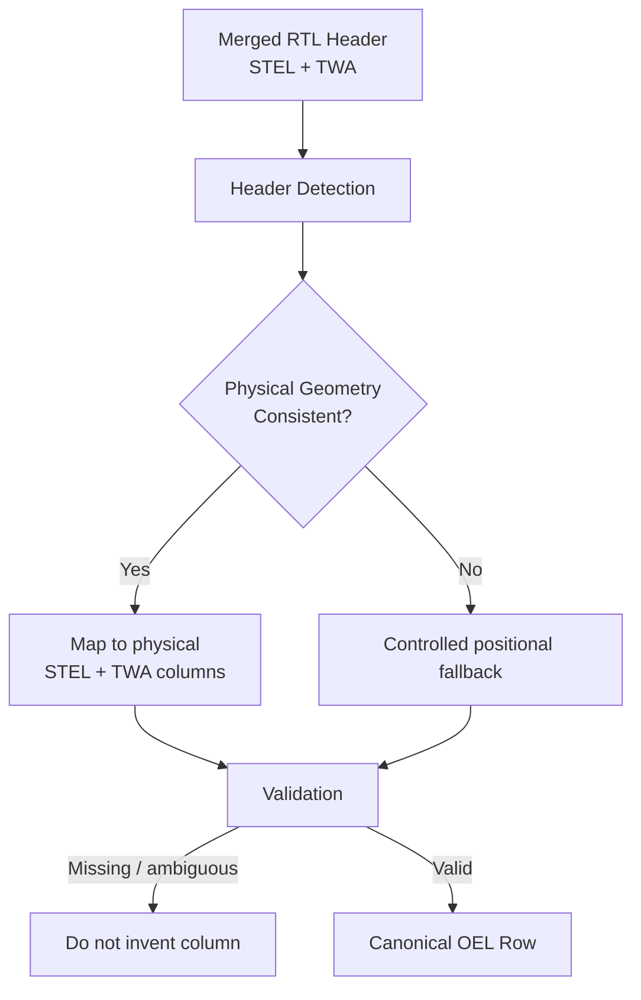
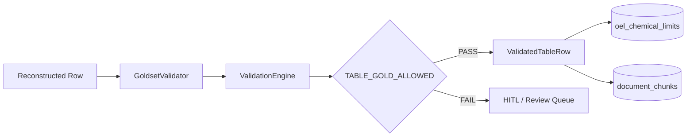
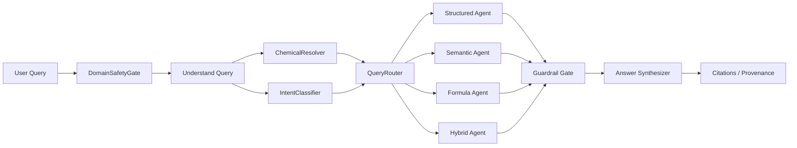
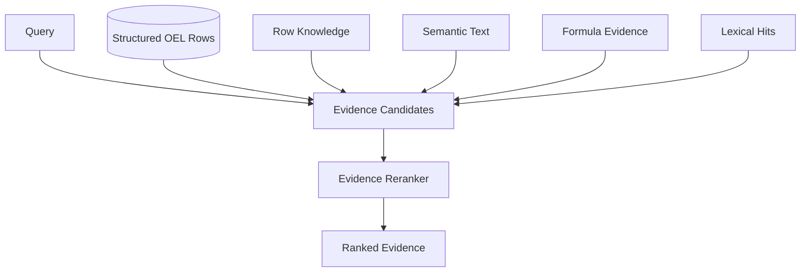

## Architecture Overview

OHSE Document Intelligence uses a **hybrid structured + semantic architecture** designed specifically for occupational health exposure documents such as OHE6/HSE6.

The core design principle is:

> **Reconstruct the physical document structure first, validate it, persist only trusted data, and never allow an LLM to become the authority for regulatory numbers.**

This is important because OEL tables contain bilingual RTL/LTR headers, merged cells, adjacent STEL/TWA columns, and inconsistent OCR reading order. A seemingly small column swap can result in an incorrect legal exposure limit.

### High-Level Architecture

 

### Detailed Architecture


---

## 1. Ingestion Layer

The ingestion layer converts the source PDF into machine-readable evidence while preserving the original document geometry.

### Components

* `pdf_loader`
* `page_classifier`
* `DocumentAIProcessor`
* `ClassicDocumentAIAdapter`
* `LayoutParserAdapter`
* `PdfGeometryResolver`
* `PageGeometryIndex`

Two complementary sources are used:

| Source      | Responsibility                                                          |
| ----------- | ----------------------------------------------------------------------- |
| Document AI | OCR, layout entities, table candidates                                  |
| PyMuPDF     | Word-level geometry, x/y coordinates, row anchors and physical recovery |

Document AI is therefore **not treated as the final source of truth**. Its output is evidence that must pass geometry and validation gates before becoming canonical data.

---

## 2. Geometry-First Table Reconstruction

The most important architectural decision is to reconstruct the **physical table grid before assigning semantic meaning to cells**.

A simplified reconstruction pipeline is:


### Why geometry comes first

Traditional OCR pipelines generally operate on reading order:

```text
OCR text → cells → semantic parsing → answer
```

That approach is unsafe for OEL tables.

This system instead follows:

```text
PDF geometry
    ↓
physical cells
    ↓
physical rows
    ↓
physical columns
    ↓
semantic fields
    ↓
validated canonical rows
```

The distinction is critical because **STEL and TWA are physical columns**, not merely two strings that can safely be inferred from text order.

---

## 3. STEL / TWA Column Resolution

The OEL table contains a particularly difficult structure where Persian RTL headers may visually merge STEL and TWA.

The canonical physical column map is:

| Column | Field              |
| -----: | ------------------ |
|      0 | `health_effect`    |
|      1 | `symbols`          |
|      2 | `STEL`             |
|      3 | `TWA`              |
|      4 | `molecular_weight` |
|      5 | `chemical_name`    |
|      6 | `row_number`       |

When a merged header contains both STEL and TWA and the molecular-weight column is detected at `column + 2`, the system expands the header into **two physical subcolumns**.



Positional fallback is intentionally limited.

> **Missing columns are never invented.**

---

## 4. Chemical Identity

Chemical identity is not based on table row position.

The primary identity model is:

```text
(page_number, CAS)
```

CAS numbers are extracted and normalized using:

* `extract_cas_values`
* `normalize_cas`
* `extract_chemical_entities_from_cell`

This prevents a row-index shift or multi-CAS visual row from causing one chemical's limits to be assigned to another chemical.

For query-time resolution, `ChemicalResolver` supports:

* CAS
* Persian chemical names
* English chemical names
* query modifiers

Ambiguous chemical resolution fails closed rather than guessing.

---

## 5. Validation and Quality Gates

Extracted values do not become canonical immediately.

The validation pipeline is:



Validation checks include:

* geometry validity
* column consistency
* header mapping
* merged-cell correctness
* numeric integrity
* row alignment
* bbox confidence
* provenance coverage
* wrong-row / cross-row matches
* STEL/TWA geometry
* chemical identity

The important safety rule is:

> **A failed quality gate results in review, not silent promotion.**

---

## 6. Two-Layer Knowledge Architecture

The persistence layer intentionally separates **structured regulatory truth** from **semantic document knowledge**.

### Layer 1 — Structured Truth

```text
PostgreSQL
└── oel_chemical_limits
```

This layer contains canonical OEL values such as:

* chemical identity
* CAS
* STEL
* TWA
* molecular weight
* source page
* provenance metadata

It is the **authority for numerical regulatory values**.

### Layer 2 — Semantic Knowledge

```text
PostgreSQL + pgvector
└── document_chunks
    ├── semantic_text
    ├── row_knowledge
    ├── embeddings
    └── metadata
```

This layer is used for:

* narrative explanations
* contextual questions
* document-level knowledge
* semantic retrieval
* supporting evidence

The two layers intentionally have different responsibilities.

| Capability         | Structured Layer | Semantic Layer    |
| ------------------ | ---------------- | ----------------- |
| Regulatory numbers | **Authority**    | Not authoritative |
| Chemical limits    | **Yes**          | No                |
| Narrative context  | Limited          | **Yes**           |
| Vector search      | No               | **Yes**           |
| Citations          | Yes              | Yes               |
| LLM interpretation | Controlled       | Yes               |

---

## 7. Query Architecture

All user queries pass through a safety and routing pipeline.



### Domain Safety Gate

The request is classified before retrieval:

```text
PASS
REJECT
BLOCK
CLARIFY
```

This prevents unrelated, unsafe, or ambiguous requests from reaching the retrieval and answering layers.

---

## 8. Intent-Based Routing

`IntentClassifier` classifies the request and `QueryRouter` selects the appropriate execution path.

### Structured Agent

Used for questions such as:

```text
What is the TWA for benzene?
What is the STEL limit for CAS 71-43-2?
```

The answer comes directly from:

```text
PostgreSQL → oel_chemical_limits
```

The LLM does **not** calculate or retrieve the number from an embedding.

### Semantic Agent

Used for questions requiring document context or narrative knowledge.

```text
Query
  ↓
Embedding / lexical retrieval
  ↓
Evidence candidates
  ↓
Reranking
  ↓
Grounded answer
```

### Formula Agent

Handles exposure-related formula and calculation questions using controlled formula logic.

### Hybrid Agent

Combines structured and semantic evidence when the query requires both canonical values and surrounding context.

---

## 9. Evidence and Retrieval

The retrieval layer creates a unified set of evidence candidates from:

* structured OEL rows
* `row_knowledge`
* semantic text
* formulas
* lexical matches

Conceptually:



The rerankers determine **which evidence is relevant**.

They do not generate or modify regulatory numbers.

---

## 10. Numeric Guardrails

Numeric answers are protected by an explicit guardrail layer.

The fundamental invariant is:

```text
LLM-generated number ≠ regulatory authority
```

For OEL numeric questions:

```text
User Question
     ↓
Chemical Resolution
     ↓
Structured Agent
     ↓
PostgreSQL Canonical Row
     ↓
Numeric Guardrail
     ↓
Answer
```

If the canonical value is absent or evidence is insufficient, the system refuses to fabricate a value.

Therefore:

* no guessed ppm
* no inferred STEL
* no inferred TWA
* no silent OCR repair
* no numeric hallucination
* no semantic-only numeric authority

---

## 11. Answer Synthesis and Provenance

`AnswerSynthesizer` uses grounded agent payloads and templates to construct the final response.

Each answer can carry provenance such as:

```text
source document
page number
source row
chunk ID
field provenance
extraction method
bbox
confidence
version / timestamp
```

The final response is therefore not just an answer; it is an **auditable answer**.


Insufficient evidence results in a refusal or clarification instead of a generated regulatory limit.

---

## 12. HITL / Human Review

Low-confidence or failed extraction is routed to a review queue.

```text
PDF
 ↓
Extraction
 ↓
Validation
 ├── PASS → Canonical DB
 │
 └── FAIL → HITL Review
              ↓
          Human Validation
              ↓
          Controlled Promotion
```

This creates an explicit boundary between:

**machine extraction → validation → human review → canonical authority**

rather than silently accepting uncertain OCR output.

---

## 13. Key Architectural Decisions

### Geometry before semantics

The system reconstructs the physical grid before interpreting fields.

### PostgreSQL as numeric authority

Canonical OEL values are stored and queried from PostgreSQL rather than generated by the LLM.

### Page + CAS identity

Chemical identity is tied to physical document evidence rather than row indexes.

### Overlay instead of destructive replacement

When Document AI provides a usable table grid but has damaged STEL/TWA geometry, PyMuPDF evidence is used as a **gated overlay repair** instead of replacing the entire Document AI result.

### Fail closed

Ambiguous chemical resolution, invalid geometry, missing columns, or insufficient evidence should produce:

```text
REJECT / CLARIFY / REVIEW / REFUSE
```

—not a plausible-looking answer.

---

## 14. Architecture in One Sentence

> **OHSE Document Intelligence is a geometry-first, validation-gated, two-layer RAG architecture where PostgreSQL is the authority for regulatory numbers and pgvector provides semantic context, with explicit routing, guardrails, provenance, and HITL review preventing extraction and generation errors from becoming compliance answers.**

---

## 15. Repository Mapping

The architecture maps directly to the repository:

```text
ohse-document-intelligence/
│
├── api/                 # FastAPI endpoints
├── agents/              # QueryOrchestrator + agents + routing
├── retrieval/           # Evidence candidates + retrieval + reranking
├── persistence/         # Evidence, semantic store, embeddings
├── database/            # PostgreSQL models + Alembic
│
├── ingestion/           # PDF loading + table recovery
├── document_ai/         # Document AI + geometry resolution
├── goldset_generator/   # Physical table reconstruction + gold generation
├── pipeline_contracts/  # Grid + numeric integrity + quality gates
│
├── validation/          # Validation logic
├── validation_engine/   # Row-level validation
├── review/              # HITL workflow
├── security/            # Domain gate + auth + rate limiting
│
├── gold/                # Frozen validation artifacts
├── data/                # Cached extraction/evaluation artifacts
├── tests/               # Architecture and correctness tests
└── docs/                # ADRs, architecture and evaluation reports
```
