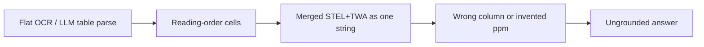
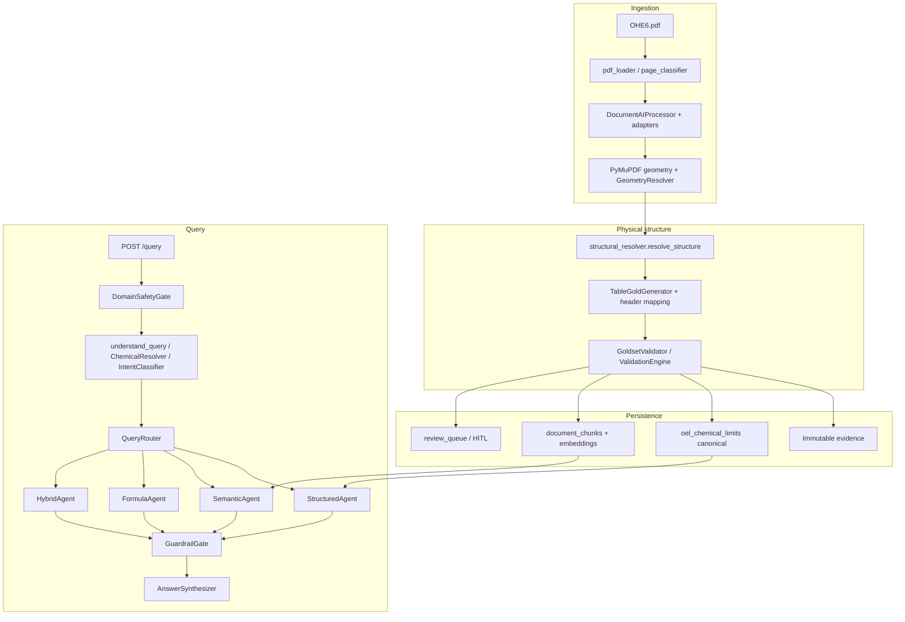

# OHSE Document Intelligence

**Hybrid structured + semantic intelligence for occupational health exposure documents (OHE6 / HSE6).**

Persian/English regulatory PDFs → geometry-first table reconstruction → PostgreSQL authority for numbers → grounded Q&A with citations.

| | |
|---|---|
| **Problem** | Complex bilingual OEL tables cannot be trusted from OCR/LLM extraction. STEL and TWA sit in adjacent physical columns under merged RTL headers. A swapped column is a wrong legal limit. |
| **Solution** | Reconstruct the **physical grid** (Document AI + PyMuPDF geometry), map columns by **bbox x-bands**, persist only validated canonical rows, and answer numeric questions from PostgreSQL — never from the LLM. |
| **Architecture** | Two layers: **structured truth** (`oel_chemical_limits`) and **semantic knowledge** (`document_chunks` + pgvector). `QueryOrchestrator` routes by intent. |
| **Key innovation** | Geometry-first STEL/TWA assignment. Identity is **page + CAS**, not row index. Overlay repairs cloned/spanning bboxes without inventing numbers. |
| **Results** | Structured wrong-chemical rate **0%** (44-case matrix). Layer-2 STEL **89.87%** / TWA **91.14%** (pages 46–55 vs Gold Excel). Router intent **93.07%** (C.4, 3,879 queries). See [Accuracy](#14-verified-results-and-metrics). |

Deeper module-level design: [`docs/ARCHITECTURE.md`](docs/ARCHITECTURE.md) · Data residency: [`docs/ADR-001-cloud-data-residency.md`](docs/ADR-001-cloud-data-residency.md) · HITL: [`docs/hitl.md`](docs/hitl.md)

---

## 1. Problem

OHE6 is a long Persian/English occupational-health PDF. The chemical section is a dense, multi-column table: health effect, notation symbols, **STEL/C**, **TWA**, molecular weight, chemical name + CAS, row number.

Ordinary pipelines fail here because:

- Headers are **merged and RTL** (“حد مجاز مواجهه TWA + STEL/C”).
- One visual row can contain **two CAS bands**.
- OCR reading order is not physical column order.
- Empty or LaTeX-garbled cells must stay `absent` / `extraction_uncertain` — never “repaired” into a plausible number.
- A STEL/TWA swap is a **compliance error**, not a UX typo.

The product requirement is: **numerical values must never be invented, inferred, guessed, or silently repaired.**

---

## 2. Why ordinary OCR is insufficient



Document AI alone often:

- Emits one cell for two physical limit columns
- Clones a bbox across STEL and TWA
- Drops a limit while keeping a name
- Returns Layout Parser blocks that are not a classic `pages[].tables[]` grid

A generic RAG stack then embeds that text and lets a model “read” a number. This system **does not** do that for OEL values.

---

## 3. High-level architecture



**Principle:** reconstruct the physical table first; map semantics second; persist only what validates; answer numbers only from canonical rows.

---

## 4–8. Table extraction, geometry, columns, identity

### Complex tables

Layer 2 (`goldset_generator.structural_resolver.resolve_structure`) is the implemented reconstruction path:

1. Geometry alignment (`_align_evidence_cells`)
2. Table detection (`table_detection_gate.evaluate_table_detection`)
3. Visual row refinement
4. Multi-CAS split (`split_table_rows_by_cas_geometry`) **before** logical merge
5. Logical rows (`_reconstruct_oel_logical_rows`)
6. Column expansion for merged STEL+TWA
7. PyMuPDF recovery only when DAI is not repairable in place

### Hybrid Document AI + PyMuPDF

| Source | Role |
|---|---|
| `DocumentAIProcessor`, `ClassicDocumentAIAdapter`, `LayoutParserAdapter` | OCR + layout entities (cached under `data/` in this repo) |
| `PdfGeometryResolver`, `PageGeometryIndex`, `recover_chemical_oel_table` | Word-level x/y, row anchors, recovered grids |
| `TableGoldGenerator._overlay_pdf_stel_twa` | Gated repair from `recover_stel_twa_from_words` |

Full replacement of a usable 8-column DAI grid is avoided: overlay was written to fix cloned geometry, not to throw the grid away.

### BBox and row reconstruction

- Trusted DAI boxes: `is_trusted_document_ai_bbox` / `resolve_bbox_inputs`
- Gate: `evaluate_cell_geometry_gate` — low-confidence boxes are not persisted
- Promotion: `resolve_promotion_cell` with row-anchor retry
- Checks: `is_numeric_wrong_row_match`, `has_cross_row_bbox_union`, `_bbox_spans_stel_and_twa`

### Physical column map (`oel_row_parser.STANDARD_OEL_COLUMN_MAP`)

| Col | Field |
|----:|---|
| 0 | health_effect |
| 1 | symbols |
| 2 | **STEL** |
| 3 | **TWA** |
| 4 | molecular_weight |
| 5 | chemical_name |
| 6 | row_number |

Merged Persian headers that contain both `stel` and `twa` with MW at `column+2` map to two physical subcolumns. Positional fallback is used only when headers are insufficient — missing columns are not invented.

### Chemical identity

- Extraction: `extract_cas_values` / `normalize_cas` (page + CAS is the row key)
- Entities: `extract_chemical_entities_from_cell`
- Query: `ChemicalResolver` (CAS, Persian/English name, modifiers — fail closed on ambiguity)
- Lookup: `PostgresStructuredStore` requires `gold_artifact_path=canonical_evidence_v1`

---

## 9–13. Intent, retrieval, evidence, answers, provenance

### Intent and routing

`IntentClassifier` (rule-based taxonomy) → `QueryRouter` → structured / semantic / formula / hybrid.

`DomainSafetyGate` runs first (`PASS` / `REJECT` / `BLOCK` / `CLARIFY`). Structured and formula intents skip embeddings.

### Structured vs semantic

| | Structured | Semantic |
|---|---|---|
| Authority | PostgreSQL OEL rows | Narrative chunks (pgvector) |
| Default path | `StructuredAgent` | `SemanticAgent` + `ProductionRetrievalPipeline` |
| Production retrieval mode | n/a | `VECTOR_METADATA` (`HYBRID_RERANK` is A/B canary) |
| Numbers | Yes, canonical only | No (guardrail) |

### Evidence candidates

`retrieval.evidence_candidates` unions structured rows, `row_knowledge`, `semantic_text`, formulas, and lexical hits **before** rerank. Numerics are copied from stored rows only. `EvidenceReranker` / `LexicalReranker` rank; they do not invent values.

### Grounded answers and citations

`AnswerSynthesizer` fills Persian templates from agent payloads. Citations are page / source-row / chunk metadata already on the result. Insufficient evidence → refusal, not a generated limit.

### Validation and provenance

- `GoldsetValidator.validate_table_field`
- `ValidationEngine.validate_table_row` before persist
- `persist_validated_rows_and_domain` writes `ValidatedTableRow` + `OELChemicalLimit` with `field_provenance`
- Quality gate `TABLE_GOLD_ALLOWED` requires geometry, columns, headers, merged cells, numeric integrity, provenance
- Failure → HITL, not silent promotion

---

## 14. Verified results and metrics

**Only figures that already exist in repo reports or evaluation artifacts.** Snapshots are dated and scoped. Later JSON dumps under `data/evaluation/` are experimental reruns, not a new official scorecard unless cited here.

### Production / corpus counts

| Count | Value | Source |
|---|---|---|
| Canonical OEL rows in DB | **349** | `docs/reports/CORRECTNESS_CLOSURE_REPORT.md` |
| Canonical `row_knowledge` chunks | **349** | same |
| Embedded semantic chunks (`semantic_text`, accepted, `fa`) | **563** (0 unembedded) | same + `docs/reports/semantic_retrieval_FINAL.md` |
| Orphan canonical chunks | **0** | Correctness closure |
| Gold index pages / tables / formulas | 367 / 59 / 6 | `docs/reports/full_pipeline_report.md` (range 46–144 run) |
| Semantic text chunks in gold corpus file | 762 | same report (file corpus, not the 563 DB subset) |
| PDF pages / table pages (full table pipeline) | 389 / 59 | `docs/reports/table_pipeline_all_pages_FINAL.md` |

### Extraction / table validation

| Metric | Value | Scope | Source |
|---|---|---|---|
| STEL correct | **76 / 79 (96.20%)** | Gold Excel vs Layer-2 cols 2–3, pages 46–55 | `docs/reports/goldset_table_value_eval_46_55.md` |
| TWA correct | **77 / 79 (97.47%)** | same | same |
| Both STEL and TWA correct | 74 / 79 (93.67%) | same | same |
| Gold rows / scored / unscored | 81 / 79 / 2 | CAS match required | same |
| `gold_allowed_rate` | 0.678 | 59 tables, full PDF table pipeline | `table_pipeline_all_pages_FINAL.md` |
| `numeric_integrity_rate` | 0.678 | same | same |
| `provenance_coverage` | 1.0 | same | same |
| `document_ai_recovery_rate` | 0.8475 | same | same |
| Extraction methods | DAI 9 / pymupdf_geometry 49 / word_grid 1 | same | same |
| Non-empty cell bbox coverage | **100%** (387/387 cells with bbox) | pages 46–55, 2026-08-03 | `docs/reports/bbox_validation_report.md` |

Layer-2 STEL/TWA scoring is **pre-overlay**. Domain persist uses table gold **after** `_overlay_pdf_stel_twa`. Do not treat a Layer-2 miss as a query miss.

### Structured correctness (query / store)

| Gate | Result | Source |
|---|---|---|
| Wrong-chemical rate | **0% (0/44)** | Correctness closure |
| Legacy-only `no_data` | **100% (18/18)** | same |
| Duplicate limit-type invariant | **0** duplicates | same |

### Retrieval / Goldset QA

| Metric | Result | Source |
|---|---|---|
| Offline n=100 Recall@5 `VECTOR_METADATA` | **67.0%** (MRR 0.665, p50 71 ms, p95 92 ms) | Correctness closure |
| Offline n=100 Recall@5 `HYBRID_RERANK` | **70.0%** (MRR 0.673) — **not** statistically different vs C (p ≈ 0.65) | same |
| Goldset QA n=100 final Hit@5 / Hit@1 / MRR | **0.660 / 0.480 / 0.565** | `data/evaluation/goldset_qa_before_after.md` + `goldset_qa_report.json` |
| Goldset QA semantic family Hit@5 / MRR | 0.691 / 0.583 | same (after evidence pipeline) |
| Goldset QA structured Hit@1 | 0.433 | same (structured agent, not global promotion) |

Production default remains **`VECTOR_METADATA`** because D vs C is a statistical tie and hybrid has a larger regression surface.

### Routing, gate, tests (documented snapshots)

| Metric | Result | Source |
|---|---|---|
| Intent accuracy (C.4, 3,879 records) | **93.07%** | `docs/reports/phase_c4_RETRIEVAL_AGENT_HARDENING_FINAL.md` |
| Structured / Formula / Conversational / Hybrid / Negative | 94.53% / 99.70% / 90.21% / 100% / 100% | same |
| Earlier E2E 100 live queries intent | 97/100 | `docs/reports/end_to_end_evaluation_FINAL.md` (2026-08-09; classifier has since changed) |
| Domain gate HSE recall | **200/200 (100%)** | `docs/reports/phase_d_PRODUCTION_READINESS.md` |
| Off-domain reject / injection block / malicious | 12/15, 14/15, 3/4 | same (synthetic) |
| Phase D tests | 56/56 | same |
| Full suite at Phase D | 334/335 (1 pre-existing env issue) | same |

**Not claimed:** a current live `pytest` count, Cloud SQL row counts after later local ingest, or Goldset QA JSONs that were not written up as official reports.

---

## 15. Local setup and API usage

### Stack

Python 3.12+ · FastAPI · SQLAlchemy 2 · Alembic · Pydantic Settings · PostgreSQL 16 + pgvector (Docker port **5434**) · GCP Document AI, GCS, Vertex embeddings (`gemini-embedding-001`, **3072** dims)

### Setup

```powershell
copy ohse-document-intelligence\.env.example ..\.env
# Set GCP project, processor ID, GCS bucket, DATABASE_URL, VECTOR_DIMENSION=3072

cd ohse-document-intelligence
docker compose up -d
pip install -r requirements.txt
alembic upgrade head

gcloud auth application-default login
gcloud config set project ohs-document-rag
```

Ingest (calls Document AI unless skipped). **Do not** run Document AI unless you intend a live GCP call; this repo already has cached `data/` artifacts.

```powershell
python scripts/process_document.py --file "../OHE6.pdf" --pages 10 --skip-document-ai
```

API:

```powershell
uvicorn api.main:app --reload --app-dir . --port 8001
```

```http
POST /query
Content-Type: application/json

{"query": "حد مجاز بنزن چقدره؟", "session_id": "optional-uuid"}
```

| Endpoint | Purpose |
|---|---|
| `GET /health` | App + DB `verify_connection` |
| `GET /metrics` | In-process counters, histograms, cache/session stats |
| `POST /query` | Orchestrated Q&A (timeout: `query_timeout_seconds`, default 30s) |
| `/review/*` + `/review/ui/` | HITL |

---

## 16. Testing

```powershell
cd ohse-document-intelligence
pytest tests/ -q
```

Targeted suites that match the architecture (do not treat a single file as the full proof):

- `tests/test_structured_authority.py` — living correctness matrix
- `tests/test_goldset_excel_46_55.py` — Layer-2 vs Gold Excel
- `tests/test_phase_c_agents.py`, `tests/test_routing_generalization.py`
- `tests/test_semantic_retrieval.py`, `tests/test_evidence_candidates.py`

Gold artifacts are validation references. **Do not regenerate or edit Gold to make tests pass.**

---

## 17. Production readiness

Honest status of what exists today. Missing items are **not implemented**.

| Area | Status |
|---|---|
| **Docker** | PostgreSQL + pgvector via `docker-compose.yml` (healthcheck `pg_isready`). **App image / Compose service for FastAPI: Not currently implemented.** No `Dockerfile` in repo. |
| **Alembic** | Present (`alembic.ini`, revisions `001`–`006`). |
| **PostgreSQL** | Local Docker on **5434**; SQLAlchemy pool (`pool_size` 30, `max_overflow` 50, `pool_pre_ping`). Production Cloud SQL: config-ready, not wired as a deployed service in this repo. |
| **Configuration** | `config/settings.py` + repo-root `.env` (`pydantic-settings`). `.env.example` documents GCP, DB, embeddings. |
| **Secrets** | Env vars + ADC. **GCP Secret Manager: Not currently implemented.** Service-account JSON keys are discouraged (ADR-001). |
| **FastAPI** | `api/main.py`: query, review, health, metrics, security headers, rate limit, request ID. |
| **Health checks** | `GET /health` verifies DB. Compose healthcheck for Postgres only. |
| **CI/CD** | **Not currently implemented** (no GitHub Actions / pipeline config in repo). |
| **Testing** | Local pytest suite; no CI gate. |
| **Logging / monitoring** | `structlog` to stdout; JSON `GET /metrics`. **Prometheus exporter, OpenTelemetry, alerting: Not currently implemented.** |
| **Backup / recovery** | Docker volume `ohse_pgdata`. **Automated backup/PITR: Not currently implemented.** |
| **Security** | `DomainSafetyGate`, optional HMAC API keys (`API_AUTH_ENABLED`, default **false**), in-process rate limit, Pydantic input limits, parameterized SQL. In-process limiter/session **do not** span instances. |

**Documented recommendation** (Phase D): conditionally ready for **controlled** single-instance deployment after enabling API auth and putting `/health` behind the hosting platform. Multi-instance needs Redis/Memorystore (deferred).

---

## 18. Known limitations and future work

- Semantic Recall@5 on the 100-query offline set is **67%** in the simpler production mode — below an 80% stretch target called out in C.3.
- Goldset QA (n=100) still shows candidate-generation and answer-generation failures (`goldset_qa_before_after.md`).
- `chemical_registry` English names include known OCR word-order scrambling (C.4 limitation; registry was not rewritten).
- Session/cache are **in-process**; lost on restart; not multi-instance safe.
- No app container, CI, Prometheus, or DB backup automation.
- Template synthesis is intentionally non-LLM (grounded, less fluent).
- Cross-encoder / BGE rerankers are interfaced; C.3 noted they were not installed in that environment.
- Document AI must not be re-called casually; use cached `data/` evidence unless a live call is explicitly authorized.

---

## Repository map

```
ohse-document-intelligence/
  api/                 FastAPI
  agents/              QueryOrchestrator, routing, structured/semantic/formula/hybrid
  retrieval/           ProductionRetrievalPipeline, evidence_candidates, lexical, rerank
  persistence/         evidence_pipeline, semantic_store, embeddings
  database/            models, Alembic
  ingestion/           PDF, triage, table_recovery, merged_row_splitter
  document_ai/         client, adapters, GeometryResolver, gating
  goldset_generator/   structural_resolver, TableGoldGenerator
  pipeline_contracts/  grids, numeric integrity, quality gates
  validation/ + validation_engine/
  review/              HITL
  security/            domain_gate, auth, rate_limit
  docs/                ARCHITECTURE.md, ADRs, reports
  gold/ + data/        frozen gold + eval artifacts
  tests/ + scripts/
```

---

## License / security notes

Do not commit `.env`, `service-account.json`, or credential JSON. Low-confidence extraction goes to HITL. SQL analytics use parameterized templates only.
