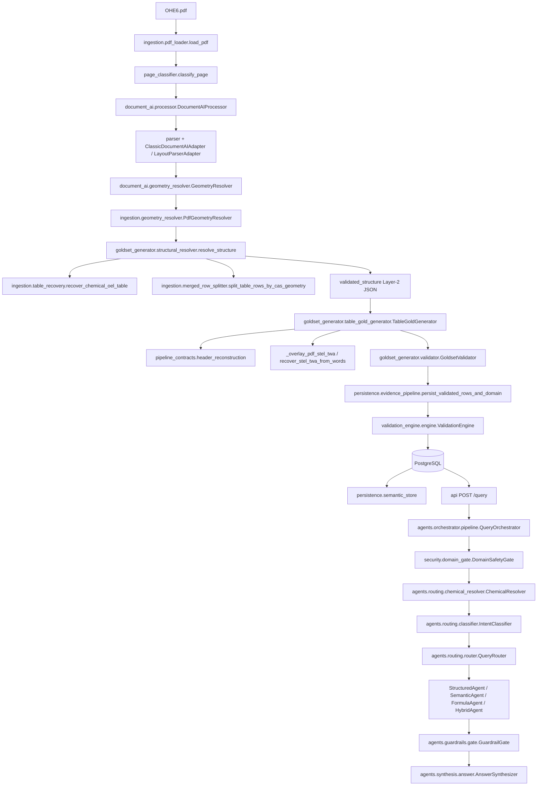

# HSE6 / OHSE Document Intelligence — Architecture

This is the **implemented** architecture, not a Phase-1 proposal. It replaces the earlier overview that still described embeddings and agents as stubs.

Companion docs:

- Table-value path: [`architecture_table_value_extraction.md`](architecture_table_value_extraction.md)
- Evidence contracts: [`architecture_evidence_pipeline_v3.md`](architecture_evidence_pipeline_v3.md)
- HITL: [`hitl.md`](hitl.md)
- Residency: [`ADR-001-cloud-data-residency.md`](ADR-001-cloud-data-residency.md)

Numeric values are never invented. If a cell cannot be parsed, status is `absent` or `extraction_uncertain` (`pipeline_contracts.numeric_integrity.parse_numeric_cell`).

---

## End-to-end pipeline

```text
PDF
 → Ingestion (pdf_loader, page_classifier)
 → Table detection (table_detection_gate)
 → Document AI (DocumentAIProcessor + adapters)   [cached under data/]
 → PyMuPDF geometry (PdfGeometryResolver, PageGeometryIndex)
 → BBox resolution (GeometryResolver, geometry_gating, geometry_promotion)
 → Row reconstruction (structural_resolver, merged_row_splitter)
 → Validation (GoldsetValidator, ValidationEngine, table_quality_gate)
 → Domain knowledge (persist_validated_rows_and_domain → oel_chemical_limits)
 → Embeddings (semantic_store / phase7 chunk rebuild)
 → Intent (IntentClassifier)
 → Routing (QueryRouter)
 → Retrieval (ProductionRetrievalPipeline / PostgresStructuredStore)
 → Evidence (evidence_candidates + rerank)
 → Answer (AnswerSynthesizer)
 → Citation (agent citations + field_provenance)
```



---

## 1. PDF and ingestion

| Module | Role |
|---|---|
| `ingestion/pdf_loader.py` | `load_pdf`, `PageContent`, `LoadedDocument`, `compute_file_hash` — PyMuPDF page text/images |
| `ingestion/page_classifier.py` | `classify_page` → `PageTriageResult` (domain keywords, formula-like pages) |
| `scripts/process_document.py` | CLI ingest; `--skip-document-ai` uses local artifacts only |

Ingestion does not write domain OEL rows. It produces pages and (when authorized) Document AI evidence.

---

## 2. Table detection

| Module | Role |
|---|---|
| `goldset_generator/table_detection_gate.py` | `evaluate_table_detection` — is this page/table a chemical-OEL grid? |
| `structural_resolver._is_chemical_oel_table` | Family check before reconstruction |
| `pipeline_contracts/table_family_classifier.py` | Deterministic family / schema; Gemini only for ambiguous **headers**, never cell values |

Detection is geometry- and rule-first. LLMs must not create or delete physical rows.

---

## 3. Document AI

| Module | Role |
|---|---|
| `document_ai/client.py` | `DocumentAIClient` — GCP processor |
| `document_ai/processor.py` | `DocumentAIProcessor` |
| `document_ai/parser.py` | `parse_document_ai_response` |
| `document_ai/adapters/classic_adapter.py` | `ClassicDocumentAIAdapter` — `pages[].tables[]` |
| `document_ai/adapters/layout_parser_adapter.py` | `LayoutParserAdapter` — Layout Parser `tableBlock` |
| `document_ai/schema.py` | `ExtractionCell`, `ExtractionTable`, `DocumentAIExtractionResult` |

This repository keeps previously generated JSON under `data/` (`document_ai_result_*.json`, evidence trees). Live Document AI calls are an explicit operational action, not part of routine agent work.

Evidence is write-once (`pipeline_contracts/evidence.py`). Downstream stages reference `evidence_ref` paths.

---

## 4. PyMuPDF geometry

| Module | Role |
|---|---|
| `ingestion/geometry_resolver.py` | `PdfGeometryResolver`, `ResolvedCellGeometry` |
| `ingestion/pdf_geometry.py` | Word index helpers (e.g. `repair_reversed_cas_brackets`) |
| `ingestion/table_recovery.py` | `recover_chemical_oel_table`, `RecoveredTable`, `_find_row_anchors`, `_assign_column_by_boundary`, `recover_stel_twa_from_words` |

**Why both processors:** Document AI is strong at layout/OCR and weak at physical column identity on these pages. PyMuPDF words have stable x/y. Recovery rebuilds a grid when `_needs_pymupdf_recovery` is true **and** the DAI grid is not `_dai_oel_grid_repairable_in_place`. Blind full replacement of an 8-column OEL table destroys cloned-bbox geometry that overlay is designed to repair.

---

## 5. BBox resolution

| Module | Role |
|---|---|
| `document_ai/geometry_resolver.py` | `GeometryResolver` — match cell text to PDF words (`document_ai_bbox_to_xywh`, `is_valid_bbox`) |
| `document_ai/bbox_provenance.py` | `is_trusted_document_ai_bbox`, `resolve_bbox_inputs` |
| `document_ai/geometry_gating.py` | `evaluate_cell_geometry_gate` → `ACCEPT` / `MISSING_BBOX` / `LOW_CONFIDENCE` |
| `document_ai/geometry_promotion.py` | `resolve_promotion_cell`, `resolve_cells_with_row_anchor_retry` |
| `document_ai/geometry_validation_checks.py` | `is_numeric_wrong_row_match`, `has_cross_row_bbox_union`, `should_flag_row_y_mismatch` |

Overlay gates in `TableGoldGenerator`: `pdf_geometry_untrusted_fields`, `_bboxes_cloned`, `_bbox_spans_stel_and_twa`, `_physical_column_of_bbox`, `pdf_row_identity_matches`, `pdf_unique_row_number_y_span`.

Low-confidence boxes are not persisted. A bbox that spans STEL and TWA is untrusted for both limit fields.

---

## 6. Row reconstruction

`goldset_generator.structural_resolver.resolve_structure` (Layer 2), documented order:

1. Geometry alignment — `_align_evidence_cells`
2. Page/table detection
3. Visual row refinement
4. Multi-CAS split — `_split_oel_multi_cas_rows` / `split_table_rows_by_cas_geometry` (`CasGeometry`, `group_cas_by_pdf_row`) **before** logical merge
5. Logical rows — `_reconstruct_oel_logical_rows` (also `document_ai.logical_row_reconstructor.reconstruct_oel_logical_rows` for 6-column OEL)
6. Column expansion — `_expand_oel_limit_columns`, `_expand_oel_basis_symbols_column`
7. Merged-cell marking — `_is_merged_cell`
8. Optional recovery — `_apply_recovered_oel_structure`

Continuation name rows merge via `_merge_casless_name_rows`, not as new chemicals.

`StructuralResolverResult` metrics: `logical_row_reconstruction_count`, `multi_cas_visual_row_split_count`, `geometry_aligned_cell_count`, `recovered_table_count`.

**Identity is page + CAS**, not physical row index (`find_actual_row` in the Gold Excel evaluator). Reconstruction changes row indexes; matching on Gold `row` would pair the wrong chemical.

---

## 7. Physical column mapping and STEL/TWA

`oel_row_parser.STANDARD_OEL_COLUMN_MAP`:

| column | field |
|--------|--------|
| 0 | health_effect |
| 1 | symbols |
| 2 | STEL |
| 3 | TWA |
| 4 | molecular_weight |
| 5 | chemical_name |
| 6 | row_number |

`TableGoldGenerator._build_header_mapping` + `CHEMICAL_HEADER_MAP`:

- Header contains both `stel` and `twa` and MW is at `column+2` → `column → STEL`, `column+1 → TWA`
- Otherwise a combined cell → `TWA_STEL` / `_parse_combined_exposure_values`
- Positional map only when fewer than two headers were detected

`pipeline_contracts.header_reconstruction.reconstruct_header_structure` supplies `header_mapping`, `header_row_indices`, `data_row_start`. `analyze_header_mapping` can set `mapping_status=review_required`.

PDF overlay (`recover_stel_twa_from_words`): words in the row y-band are assigned by `_assign_column_by_boundary`. **Column 2 = STEL/C (left of the pair), column 3 = TWA.** Assignment is physical x, not DAI reading order.

Anti-swap rules (implemented):

1. Overlay refuses when STEL and TWA share the same `cell_id`.
2. `pdf_overrides_complete_dai_limits` may replace complete DAI numbers only when PDF x-bands are a **permutation of the same two decimals** (column swap). Different PDF numbers must not overwrite both DAI limits.
3. Row identity must be proven before filling empty limits from a y-band.
4. LaTeX OCR in limit cells → `extraction_uncertain` (`LATEX_ARTIFACT_PATTERN`), not “absent” filled from a neighbor.
5. Query path does not re-parse the PDF.

RTL: `parse_molecular_weight` may reverse slash MW tokens only when the RTL pattern matches. Limit overlay uses x-band so RTL cell order cannot swap STEL/TWA if geometry is trusted.

---

## 8. Validation

| Module | Role |
|---|---|
| `goldset_generator/validator.py` | `GoldsetValidator.validate_table_field` |
| `validation_engine/engine.py` | `ValidationEngine.validate_table_row` |
| `pipeline_contracts/table_quality_gate.py` | `evaluate_table_quality` — `TABLE_GOLD_ALLOWED` |
| `pipeline_contracts/numeric_integrity.py` | `parse_numeric_cell` |
| `validation/` | Confidence scoring helpers |

`TABLE_GOLD_ALLOWED` requires: `geometry_valid`, `column_count_valid`, `header_structure_valid`, `merged_cells_valid`, `numeric_integrity_valid`, `provenance_complete`.

Typed codes include `EXTRACTION_UNCERTAIN`, `MERGED_CELL_UNRESOLVED`, `CAS_INVALID`, `COLUMN_AMBIGUOUS`, `VALUE_NOT_IN_EVIDENCE` (see evidence pipeline v3). Failures go to HITL, not silent domain write.

**Evaluator caveat:** `validate_stel_twa` / `tests/test_goldset_excel_46_55.py` compare Gold Excel to **Layer-2 column text**, not overlay and not Postgres. Overlay can still repair a Layer-2 swap before persist.

---

## 9. Domain knowledge and embeddings

| Module | Role |
|---|---|
| `persistence/evidence_pipeline.py` | `persist_validated_rows_and_domain` — `ValidatedTableRow` + `OELChemicalLimit` |
| `persistence/chemical_identity.py` | Registry linking / CAS identity helpers |
| `persistence/row_knowledge_text.py` | Row-level knowledge text for retrieval |
| `persistence/canonical_chunk_store.py` | Canonical chunk identity |
| `persistence/semantic_store.py` | Embed + `search_persian_semantic` (hard filters: `source_type=semantic_text`, `validation_status=accepted`, `language=fa`) |
| `persistence/phase7_chunk_rebuild.py` | Corpus rebuild / embed |
| `database/models.py` | `ChemicalRegistry`, `OELChemicalLimit`, `DocumentChunk`, evidence/HITL tables |

Layered storage:

| Layer | Tables | Mutable? |
|---|---|---|
| Evidence | `documents`, `document_pages` | Immutable after write |
| Universal | `extracted_tables`, `table_cells`, `formulas` | Derived |
| Domain | `chemical_registry`, `oel_chemical_limits`, … | Validated only |
| Semantic | `document_chunks` + pgvector | Accepted chunks only |
| HITL | `review_tasks`, `no_data_events`, … | Workflow |

Embeddings: `gemini-embedding-001` at **3072** dimensions (`VECTOR_DIMENSION`). pgvector HNSW does not support 3072 dims; sequential scan is the documented production search method for this corpus size.

Gemini boundaries: schema/header disambiguation only. **Never** cell value extraction, table reconstruction, or CAS/ppm/MW inference.

---

## 10. Query: intent, routing, retrieval, evidence, answer, citation

```text
POST /query
  → Security middleware (request ID, rate limit, headers)
  → QueryRequest validation
  → QueryOrchestrator.handle
       DomainSafetyGate
       SessionContextManager
       query understanding + ChemicalResolver + extract_slots
       IntentClassifier
       QueryRouter
       StructuredAgent | SemanticAgent | FormulaAgent | HybridAgent
       GuardrailGate
       AnswerSynthesizer
  → QueryResponse (answer, intent, citations, trace_id, gate_decision)
```

| Module | Classes | Role |
|---|---|---|
| `api/routers/query.py` | `QueryRequest`, `execute_query` | Timeout wrapper (`query_timeout_seconds`) |
| `api/main.py` | FastAPI app | `/health`, `/metrics`, `/query`, `/review` |
| `security/domain_gate.py` | `DomainSafetyGate` | PASS / REJECT / BLOCK / CLARIFY before agents |
| `agents/orchestrator/pipeline.py` | `QueryOrchestrator`, `QueryResponse` | End-to-end query |
| `agents/orchestrator/trace.py` | `QueryTrace` | `trace_id`, slots, `no_data_reason` |
| `agents/routing/chemical_resolver.py` | `ChemicalResolver`, `ChemicalResolution` | CAS / name / modifier resolution |
| `agents/routing/classifier.py` | `IntentClassifier` | Rule-based taxonomy |
| `agents/routing/router.py` | `QueryRouter` | Agent plan |
| `agents/structured/store.py` | `PostgresStructuredStore` | Canonical-only lookup (`canonical_evidence_v1`) |
| `agents/structured/authority.py` | `validate_authoritative_oel_row` | Wrong-chemical fail-closed |
| `agents/structured/agent.py` | `StructuredAgent` | OEL answers |
| `agents/semantic/agent.py` | `SemanticAgent` | RAG; default `VECTOR_METADATA` |
| `agents/formula/agent.py` | `FormulaAgent` | Deterministic formulas |
| `agents/hybrid/agent.py` | `HybridAgent` | Multi-agent plan |
| `retrieval/pipeline.py` | `ProductionRetrievalPipeline`, `RetrievalMode` | Vector + lexical + metadata + fusion |
| `retrieval/evidence_candidates.py` | `union_additive_candidates`, … | Multi-source candidates **before** rerank |
| `retrieval/lexical_index.py` | `LexicalIndex` | BM25-style Persian lexical |
| `retrieval/reranker.py` | `EvidenceReranker`, `LexicalReranker` | Rank only |
| `retrieval/scope_audit.py` | — | Filter parity (vector vs lexical) |
| `agents/guardrails/gate.py` | `GuardrailGate` | Numeric authority + citation |
| `agents/synthesis/answer.py` | `AnswerSynthesizer` | Template Persian text, no LLM facts |
| `agents/session/store.py` | `SessionStore` | In-process TTL sessions |

### Structured vs semantic (contract)

- Structured reads require `validation_status=accepted` and `gold_artifact_path=canonical_evidence_v1`. Legacy rows → `no_data` / `PENDING_PROMOTION`, not an authoritative ppm.
- Semantic search excludes test chunks and non-accepted rows. Content is returned verbatim. `GuardrailGate` forbids using semantic chunks as the source of OEL numbers.
- Production retrieval default: `RetrievalMode.VECTOR_METADATA`. `HYBRID_RERANK` is the documented A/B canary; after a scope bug, lexical and vector paths must share the same page filter (`_apply_page_scope`).

### Evidence candidates

Sources: structured OEL rows, `row_knowledge`, `semantic_text`, formulas, lexical. `annotate_candidate` / identity patterns use **query-grounded** CAS/name tokens (inherited session slots alone do not count). Rerank cannot introduce a number that is not already on a stored row.

### Citations and provenance

Persisted fields carry `field_provenance`: `cell_id`, `bbox`, `value_status`, `original_value` (`fact_resolver.resolve_field_display`). Agent citations attach page and source-row / chunk ids from those records. Synthesis does not create citations that were not returned by an agent.

---

## 11. Cross-cutting production modules

| Concern | Implementation |
|---|---|
| Config | `config/settings.py` `Settings` — `.env` at repo root |
| Logging | `config/logging.py` — structlog to stdout |
| Metrics | `observability/metrics.py` — in-process counters/histograms; `GET /metrics` |
| Auth | `security/auth.py` — optional HMAC API keys |
| Rate limit | `security/rate_limit.py` — in-process token bucket |
| Cache | `cache/ttl_cache.py` — embedding + query response |
| DB | `database/session.py` — pool, `CREATE EXTENSION vector` |
| Migrations | `database/migrations/versions/001`–`006` |
| Review | `review/review_service.py`, `api/routers/review.py` |

Not in this architecture as running systems: CI/CD, app Docker image, Prometheus, OpenTelemetry, Secret Manager, Redis, automated PostgreSQL backup.

---

## 12. What Gold evaluators measure

| Evaluator | Compares | Does not measure |
|---|---|---|
| `tests/test_goldset_excel_46_55.py` / `validate_stel_twa` | Gold Excel ↔ Layer-2 columns 2–3 | Overlay, Postgres, query |
| `GoldsetQAEvaluator` (`scripts/evaluate_goldset_qa.py`) | Goldset QA ↔ orchestrator/retrieval | Layer-2 cell text |
| Structured authority matrix | Query/store vs canonical chemicals | Table OCR |

Treat Gold-vs-Layer-2 misses as **extraction/geometry**, and Gold-vs-query misses as **retrieval/routing**, unless proven otherwise.

---

## 13. Scaling a new table family

Per evidence pipeline v3: add a schema in `schema_registry/`, deterministic header aliases, extend `TableFamilyClassifier`. Do not change evidence, grid, or validation contracts. That is the difference between a document platform and a pile of extraction scripts.
