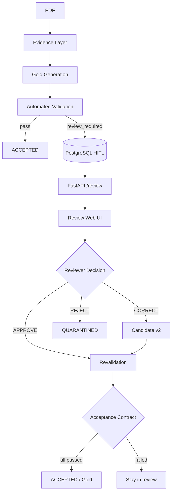

# Human-in-the-Loop (HITL) Review System

Production-grade human review workflow for HSE6 Document Intelligence.

**PostgreSQL is the system of record.** Reviewers interact through a web UI backed by FastAPI. They never edit PostgreSQL directly or manually edit JSON gold files.

---

## Where HITL Sits in the Pipeline

HITL is a **workflow layer around existing extraction and validation artifacts** — not a parallel review system and not a duplicate of pipeline data.

```text
PDF
 │
 ▼
Evidence (immutable OCR / cells / bboxes)
 │
 ▼
Structure Detection + Table/Formula Gold Generation
 │
 ▼
Automated Validation  (GoldsetValidator + ValidationEngine)
 │
 ├──────────────────────────────┐
 │                              │
PASS                      REVIEW_REQUIRED /
 │                    EXTRACTION_UNCERTAIN / FAILED
 ▼                              │
ACCEPTED                         ▼
                          PostgreSQL
                    extraction_candidates (v1)
                    validation_runs
                    validation_issues  ← machine-only
                    review_tasks       ← human cases
                              │
                              ▼
                     FastAPI  /review/*
                              │
                              ▼
                     Review Web UI  /review/ui/
                              │
              ┌───────────────┼───────────────┐
              ▼               ▼               ▼
           APPROVE         CORRECT          REJECT
              │               │               │
              └─────── revalidation ──────────┘
                              │
                              ▼
                    Acceptance Contract
                    (all 7 dimensions must pass)
                              │
                    ┌─────────┴─────────┐
                    ▼                   ▼
              ACCEPTED / GOLD      QUARANTINED
           (candidate.status)   (never promoted)
```

### Mermaid view



---

## Core Invariants

These rules are enforced in code, not just documented:

| Rule | How it is enforced |
|---|---|
| **No duplication** | Review tables reference existing `documents`, pages, and stable IDs (`table_047_01`). Payloads are stored once per candidate version. |
| **Evidence is immutable** | Original PDF cells, bboxes, and `original_value` are never overwritten. Corrections create new candidate versions. |
| **Versioned candidates** | CORRECT always produces `v2` with `parent_version_id = v1`; `v1 → SUPERSEDED`. |
| **Human approval ≠ bypass** | APPROVE and CORRECT both trigger **revalidation** + the **acceptance contract**. A reviewer cannot push data to Gold without all dimensions passing. |
| **Machine vs human separation** | `validation_issues` are machine-generated signals. `review_tasks` are grouped human cases built from those signals. |
| **Full audit trail** | Every claim, decision, correction, and validation run is logged in `review_events` (append-only). |
| **Rejected data preserved** | REJECT → `QUARANTINED`; data is kept for debugging and future model improvements, never silently deleted. |

---

## Database Tables

| Table | Purpose |
|---|---|
| `extraction_candidates` | Versioned extraction snapshots (`v1`, `v2`, …). Statuses: `candidate`, `accepted`, `quarantined`, `superseded`. |
| `validation_runs` | One row per validation/revalidation attempt against a candidate, with full report + acceptance contract result. |
| `validation_issues` | Individual machine-detected problems (code, severity, field, message, metadata). Not shown raw to reviewers. |
| `review_tasks` | Human review **cases** — one task per table/page/formula target, grouping related issues. |
| `review_decisions` | Append-only history of APPROVE / CORRECT / REJECT with reviewer, comment, status transition. |
| `review_corrections` | Auditable field-level edits from CORRECT (target path, original value, corrected value). |
| `review_events` | Immutable audit log (`TASK_CREATED`, `TASK_CLAIMED`, `DECISION_SUBMITTED`, `VALIDATION_COMPLETED`, …). |
| `review_queue` | **Legacy JSON bridge only** — not used for new production workflow. |

### Candidate lifecycle

```text
v1  CANDIDATE  ──CORRECT──►  v2  CANDIDATE  ──revalidation + contract──►  ACCEPTED
 │                                │
 └── SUPERSEDED                   └── QUARANTINED  (if REJECT or contract fails)
```

### Review task lifecycle

```text
PENDING ──claim (30 min lease)──► IN_PROGRESS
IN_PROGRESS ──release / lease expiry──► PENDING
IN_PROGRESS ──APPROVE or CORRECT + contract pass──► RESOLVED
IN_PROGRESS ──REJECT (reason required)──► REJECTED
PENDING / IN_PROGRESS ──superseded by pipeline──► CANCELLED
```

---

## Service Layer (`review/`)

| Module | Responsibility |
|---|---|
| `candidate_store.py` | Create/version candidates; apply corrections; materialize missing columns from immutable evidence; mark `ACCEPTED` / `QUARANTINED` / `SUPERSEDED`. |
| `acceptance_contract.py` | Deterministic pass/fail across 7 validation dimensions. All must be `"passed"` for promotion to Gold. |
| `revalidation.py` | Re-runs validation after APPROVE/CORRECT; dispatches by `candidate_type` (table vs formula). |
| `review_priority.py` | Computes `CRITICAL` / `HIGH` / `MEDIUM` / `LOW` from issue codes and severities. |
| `review_assignment.py` | Claim/release with lease (default 30 min); prevents concurrent editing. |
| `task_factory.py` | Groups machine issues into one human case per target; idempotent upsert; builds titles/descriptions. |
| `issue_explainer.py` | Translates raw machine codes into plain-language, actionable `human_message` strings for the UI. |
| `review_events.py` | Writes append-only audit events. |
| `evidence_store.py` | Loads immutable source table cells from `data/evidence/` for display and structural recovery. |
| `review_service.py` | Orchestrates all actions exposed by the API (list, claim, approve, correct, reject, history). |
| `integration.py` | `sync_page_to_hitl()` — called from the goldset pipeline after page validation. |
| `schemas.py` | Pydantic request/response models for the review API. |

Legacy bridge: `scripts/bridge_hitl_review.py` imports existing `validation_page_*.json` and `review_queue.json` into PostgreSQL for pages already processed before HITL was added.

---

## Acceptance Contract

All seven dimensions must return `"passed"` before `candidate.status → accepted`:

- `numeric_integrity`
- `cell_reference_integrity`
- `bbox_integrity`
- `table_structure`
- `cas_validation`
- `unit_validation`
- `semantic_validation`

High extraction confidence **never** overrides a hard validation failure.

---

## Reviewer Workflows

### APPROVE

> "I inspected the PDF evidence and confirm the candidate is correct."

1. Reviewer claims task (`IN_PROGRESS`, 30 min lease)
2. Submits APPROVE
3. System runs **revalidation** on the linked candidate
4. **Acceptance contract** evaluated
5. If all dimensions pass → task `RESOLVED`, candidate `ACCEPTED` → eligible for Gold
6. If contract fails → task stays in review with updated validation issues

**Observational tasks** (legacy items with no linked `extraction_candidate`): APPROVE resolves the task without revalidation — there is nothing to revalidate.

### CORRECT

> "The extraction is wrong; here is the fix."

1. Reviewer edits values through the UI (table cells, header mappings, formula fields)
2. System records `review_corrections` with **original value preserved**
3. Creates **candidate v2** (`parent_version_id = v1`, `v1 → SUPERSEDED`)
4. Structural corrections supported:
   - Header remapping (e.g. duplicate `TWA` → split into `STEL` + `TWA`)
   - `materialize_table_column()` — rebuilds a missing column (e.g. STEL/C) from immutable evidence cells
5. Revalidation + acceptance contract run on v2
6. If passed → `RESOLVED` + `ACCEPTED`; if failed → stays in review

### REJECT

> "This extraction is fundamentally wrong or unusable."

1. Reason is **required**
2. Candidate → `QUARANTINED`
3. Task → `REJECTED`
4. Data never enters trusted Gold; full audit trail preserved

---

## Three Layers the UI Must Distinguish

The review UI always separates:

| Layer | Source | Mutable? |
|---|---|---|
| **Original evidence** | Immutable PDF/OCR cells (`data/evidence/`) | Never |
| **AI candidate** | `extraction_candidates` v1 payload | Never (superseded, not edited) |
| **Human correction** | `review_corrections` → candidate v2 | Creates new version only |
| **Validated Gold** | `candidate.status = accepted` after contract | Promoted only after contract pass |

---

## API Endpoints

Base path: `/review`

| Method | Path | Description |
|---|---|---|
| GET | `/review/tasks` | List review queue (filters: status, priority, issue_code, document, page, target_type) |
| GET | `/review/tasks/{id}` | Task detail + candidate payload + machine issues with `human_message` |
| POST | `/review/tasks/{id}/claim` | Claim with 30 min lease |
| POST | `/review/tasks/{id}/release` | Release claim |
| POST | `/review/tasks/{id}/approve` | Approve → revalidate |
| POST | `/review/tasks/{id}/correct` | Submit corrections → v2 → revalidate |
| POST | `/review/tasks/{id}/reject` | Reject → quarantine (reason required) |
| GET | `/review/tasks/{id}/evidence` | Evidence cells + candidate data |
| GET | `/review/tasks/{id}/evidence/page-image` | Rendered PDF page image |
| GET | `/review/tasks/{id}/history` | Append-only audit events |

Request/response schemas: `review/schemas.py`

---

## Web UI

Open: `http://localhost:8000/review/ui/`

### Queue view

- Priority-sorted task list (`CRITICAL` → `LOW`)
- Filters: status, priority, issue type, document, page, target type
- Shows: claim status, lease expiry, assigned reviewer, primary issue code

### Detail view

| Panel | Content |
|---|---|
| **Original PDF / Evidence** | Rendered page image + source cell list |
| **Extracted Candidate** | Current candidate table/formula with `original_value` shown per field |
| **Validation Issues** | Human-readable `human_message` per machine issue |
| **Corrections form** | Editable fields for CORRECT workflow |

### CORRECT form supports

- Table header mapping (with OEL field choices: TWA, STEL, ceiling, …)
- Individual table cell values and units
- Formula reference values and units (dotted paths like `semantics.reference_values.0.reference_value`)
- Structural guidance when a merged exposure column (TWA + STEL/C) was incorrectly mapped

### Actions

- **APPROVE** — disabled path if no candidate linked (observational items resolve without revalidation)
- **CORRECT** — disabled if no linked candidate
- **REJECT** — requires reason text

Default reviewer ID in UI: configure in the claim/approve request body (e.g. `sahar khalafi`).

---

## Formula Candidates

Formulas follow the same lifecycle as tables:

- `candidate_type = "formula"`, stable ID = formula ID
- `review.revalidation.validate_candidate()` dispatches to `validate_formula_candidate()` or `validate_table_candidate()`
- CORRECT supports generic dotted-path fields via `CandidateStore.apply_corrections_to_payload`
- Bridge script links formula issues to formula candidates (not generic page-level tasks)

---

## Human-Readable Issue Messages

Raw validator output is not shown to reviewers. `review/issue_explainer.py` translates every issue before it reaches the UI:

| Raw signal | Human message example |
|---|---|
| `VALUE_NOT_IN_EVIDENCE` + placeholder `field_name` | "The extraction left an unresolved placeholder instead of a real value from the PDF…" |
| `COLUMN_AMBIGUOUS` | "Two or more table columns could map to the same field. Check the PDF header row…" |
| `EXTRACTION_UNCERTAIN` on `STEL`/`TWA` | "Exposure limit value unreadable — the cell has a unit but digits couldn't be read (often OCR misreads decorative PDF fonts as \\cdot, \\Delta, \\pi)…" |
| `NUMERIC_NORMALIZATION` | "Numeric value needs review — check this number against the PDF." |
| Legacy untyped strings | Reclassified into structured codes (`ENTITY_VALUE_MISMATCH`, `TRIPLE_VALUE_MISMATCH`, …) |

`dedupe_issues()` removes exact duplicates accumulated from append-only legacy `review_queue.json`.

The API passes `field` into `explain_issue()` so field-specific messages (e.g. STEL vs TWA) render correctly in `/review/tasks/{id}`.

---

## Stale Issue Handling

Because `review_queue.json` is append-only across pipeline reruns, the bridge script applies freshness checks:

- **Formula tasks**: skipped if current `gold/formulas/{id}.json` already has `status = "approved"`
- **Page-level tasks**: cancelled when superseded by more specific FORMULA or TABLE tasks after regrouping
- Audit event `superseded_by_regrouping` logged for each cancellation

Re-running the pipeline after a code fix (e.g. STEL column detection) requires re-bridging to refresh PostgreSQL tasks.

---

## Running

```bash
# 1. Migrate database
cd ohse-document-intelligence
alembic -c database/migrations/alembic.ini upgrade head

# 2. Bridge existing goldset data (example: pages 46–70)
python scripts/bridge_hitl_review.py --pages 46 47 48 49 50 51 52 53 54 55 --import-queue

# 3. Start API + UI
uvicorn api.main:app --reload --app-dir .

# 4. Open reviewer dashboard
# http://localhost:8000/review/ui/
```

Configuration (`config/settings.py`):

- `review_claim_lease_minutes` — default **30**
- `pdf_source_path` — path to source PDF for page image rendering

---

## Example: Page 47 (merged OEL column)

1. Pipeline produces `validation_page_047.json` with `review_required`
2. Bridge creates `extraction_candidates` v1 for `table_047_01`
3. `validation_run` records machine issues (`COLUMN_AMBIGUOUS`, `VALUE_NOT_IN_EVIDENCE`)
4. One grouped `review_task` for `table_047_01`
5. Reviewer opens UI → sees PDF + extracted table side by side
6. **CORRECT**: remaps column 4 header from duplicate `TWA` → `STEL`; system materializes STEL values from evidence
7. Candidate v2 created; v1 → `SUPERSEDED`
8. Revalidation + acceptance contract
9. All dimensions pass → task `RESOLVED`, candidate `ACCEPTED` → eligible for Gold

---

## Example: Page 54 (OCR-corrupted STEL digits)

Some OEL tables merge TWA and STEL/C into one physical column. Document AI sometimes OCRs Persian digits as LaTeX tokens (`\cdot`, `\Delta`, `\tau`) instead of numbers.

Pipeline behavior after fix:

- TWA value extracted when readable
- STEL marked `extraction_uncertain` (not silently `absent`) when a second unit marker or LaTeX artifact is present
- Review task created with human-readable message directing reviewer to read STEL from PDF and enter via CORRECT

---

## Operational Notes

- **Idempotency key**: `{document}:{pipeline_version}:{target_type}:{target_id}`
- **Reviewer type**: only `ReviewerType.HUMAN` may submit APPROVE / CORRECT / REJECT
- **Lease expiry**: expired claims auto-return task to `PENDING`
- **Concurrency**: two reviewers cannot edit the same task simultaneously (DB row lock on claim)
- **Rejected / quarantined data**: preserved for audit and future pipeline improvements

---

## File Map

```text
review/
  acceptance_contract.py    # 7-dimension pass/fail policy
  candidate_store.py        # Versioned candidates + corrections
  evidence_store.py         # Immutable evidence cell loader
  integration.py            # Pipeline → HITL hook
  issue_explainer.py        # Human-readable issue messages
  revalidation.py           # Post-decision validation
  review_assignment.py      # Claim / lease
  review_events.py          # Audit log writer
  review_priority.py        # CRITICAL → LOW scoring
  review_service.py         # Main orchestrator
  task_factory.py           # Issue grouping → review_tasks
  schemas.py                # API models
  ui/                       # Reviewer dashboard (static)
api/routers/review.py       # FastAPI endpoints
database/migrations/versions/004_hitl_review_system.py
scripts/bridge_hitl_review.py
tests/test_hitl_review.py
```
